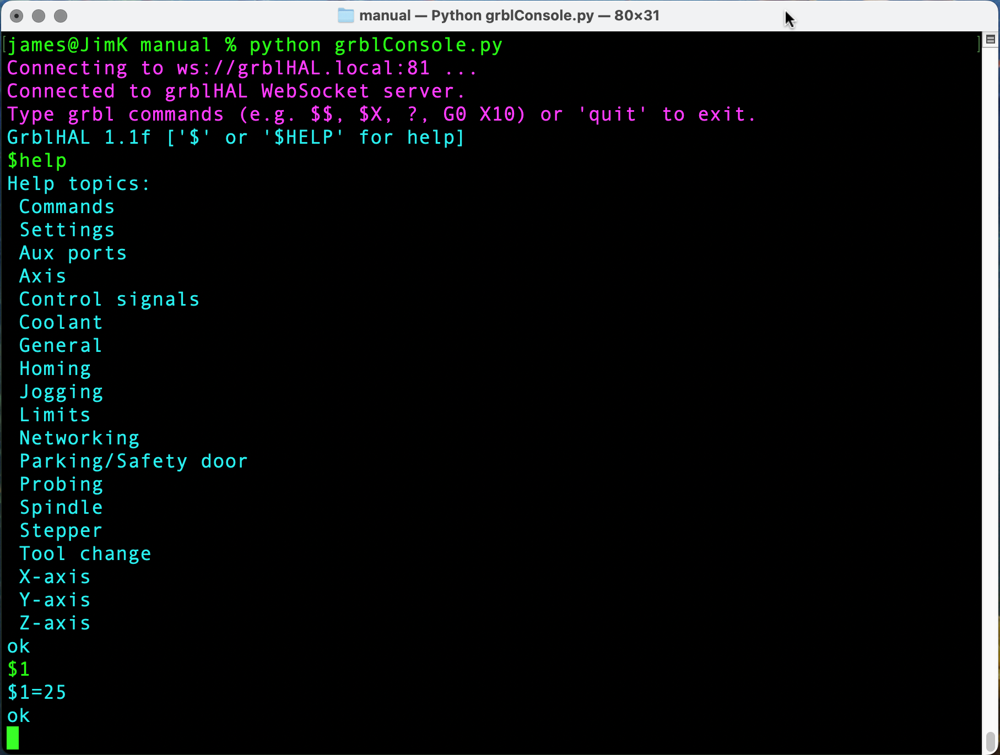
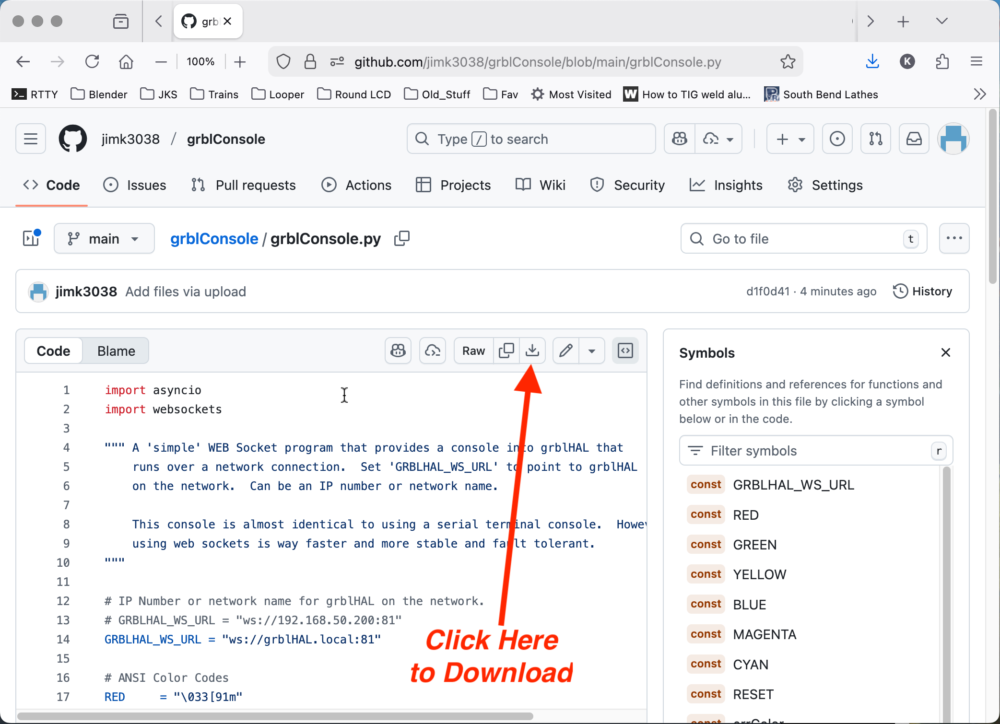

# grblConsole
<h1>Python Web Socket Console</h1>
<h2>Simple little python app that provides a network console to grblHAL.</h2>

Edit the Python code to change 'GRBLHAL_WS_URL = "ws://grblHAL.local:81"' to match the IP number or network name to your networked grblHAL board.  Note, the ':81' refers to port number used by grblHAL which seems to be 81 for web sockets.

By the way, you can also change the color coding to match your preferences.  See the python comments near the top of the code for instructions.  

<!--
# If you want to control display size, you can use an HTML tag:
# 
-->

**Install and Usage**

* Install dependencies: 'pip install websockets'.

* To install app and run: click on 'grblConsole.py' from the file list above.  Then, click the download button as shown below.  Download somewhere on your computer.  Then, startup in a console window with 'python grblConsole.py'.  If your python code matches the network address of grblHAL you should see something like above.

Enjoy
